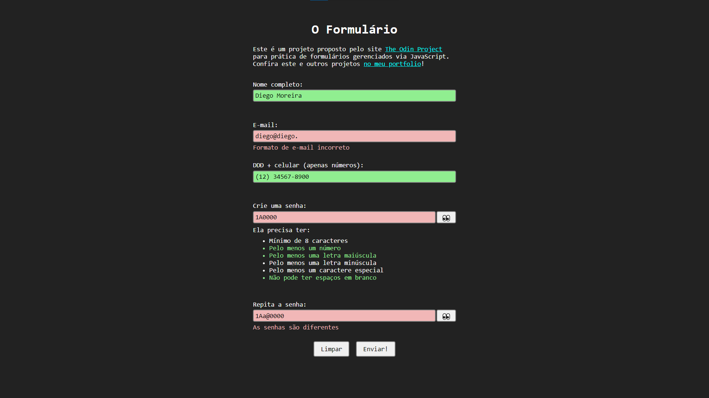

# Validação de Formulários com JavaScript

Este é um pequeno projeto proposto pelo site [The Odin Project](https://www.theodinproject.com/) para prática de validação de formulários com JavaScript, usando a [API de validação de restrição](https://developer.mozilla.org/en-US/docs/Learn/Forms/Form_validation#validating_forms_using_javascript). Confira o projeto em [diego-moreira8.github.io/odin-form-validation-js](https://diego-moreira8.github.io/odin-form-validation-js/)



## Funcionalidades

- Valida se os campos requeridos foram preenchidos de forma correta;
- Mostra mensagens descrevendo o que há de errado no campo;
- Formata o número de ceular para o padrão brasileiro;
- Mostra se cada regra de senha foi atendida enquanto o usuário a digita;
- Botão de espiar senha.

## Como usar

1. Clone o repositório:

```bash
git clone https://github.com/Diego-Moreira8/odin-form-validation-js.git
```

2. Abra o arquivo `index.html` com o seu navegador favorito.
